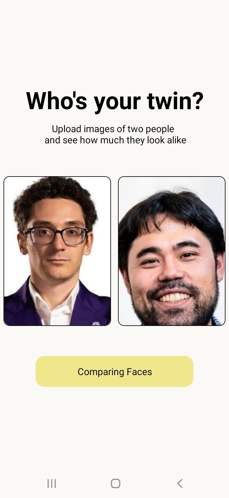
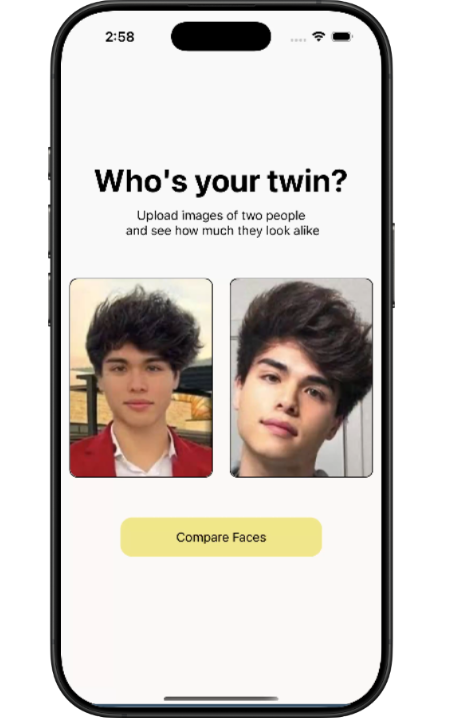
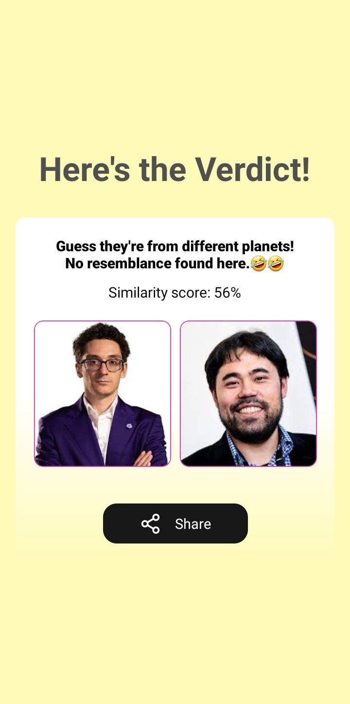
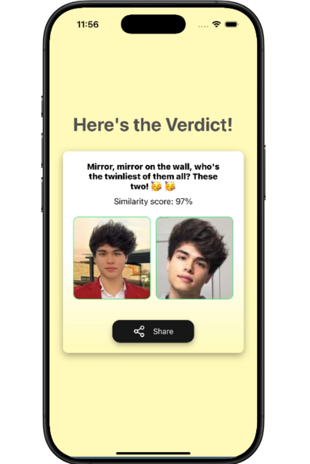

# Facial Recognition Demo Frontend

This repository contains a **frontend prototype** I contributed to as part of a small team (with backend and frontend engineers).  
It was originally developed to **test and visualize the performance of a facial recognition system** being built at the time.

I have moved **my personal copy** of the frontend here to my official GitHub profile **strictly for portfolio and demonstrative purposes**.  
**Full ownership remains with the original company and team — this is *not* a redistribution of the backend or private data.**

---

### 🔧 What This Frontend Does

- Splash screen & login flow  
- Success / result screen (face match result)  
- Compare Screen → input two photos and get similarity score  
- Live camera feed capture page for facial testing  
- Designed purely to **show backend API responses visually**

> Note: The backend/API is **not included here** — I may later connect this to a mock server or public face recognition playground for demo purposes.

---

### 🧩 My Contribution

I was involved across the core user journey — from the splash/login flow all the way to the image comparison and final result experience.

Specifically contributed to:
- ✅ Result / Success Screen
- ✅ Compare Screen (image input & similarity output)
- ✅ Assisted in early flow screens (splash / authentication)

---

### 📸 Screenshots (UI Preview)

**1. Compare Screen**  
_User selects or uploads two images to compare_  

                      

---

**2A. Result — No Match Found**  
_Shows low similarity with a playful response_  

**2B. Result — Strong Match**  
_Shows high similarity with celebration feedback_  

